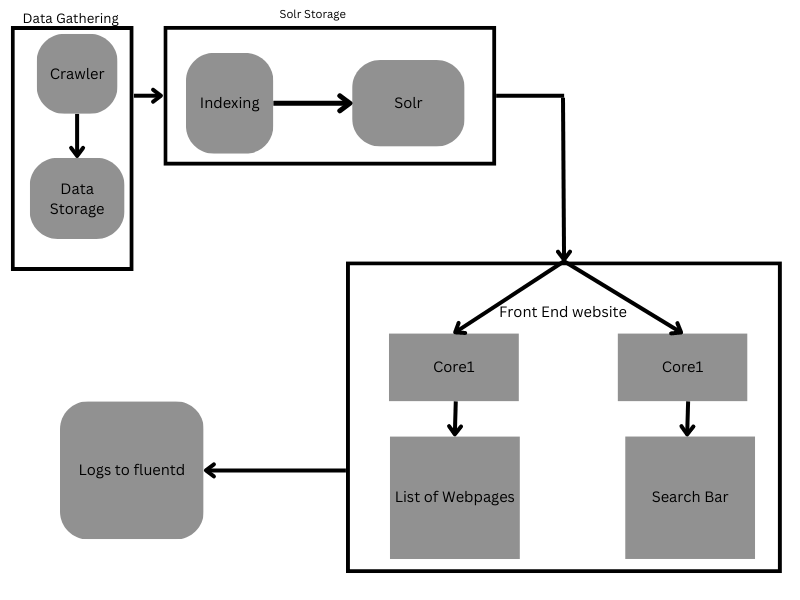

# NewsApp

NewsApp is a Django project that gathers news across various categories using Solr search engine.

## Features

- News aggregation: The application gathers news from multiple sources and displays them based on categories.
- Category filtering: Users can browse news articles by selecting specific categories.
- Search functionality: Users can search for news articles using keywords.
- Pagination: The news articles are displayed in paginated format for easy navigation.
- Responsive design: The application is built with a responsive design, ensuring optimal user experience across devices.

## Design

Aggregator and Indexing Modules : https://github.com/subhajit1997/newsbox-parent.git

## Setup and Installation

1. Clone the repository:
2. To Run:
   `cd /newsbox`
   `python manage.py runserver`
3. Open http://127.0.0.1:8000/

